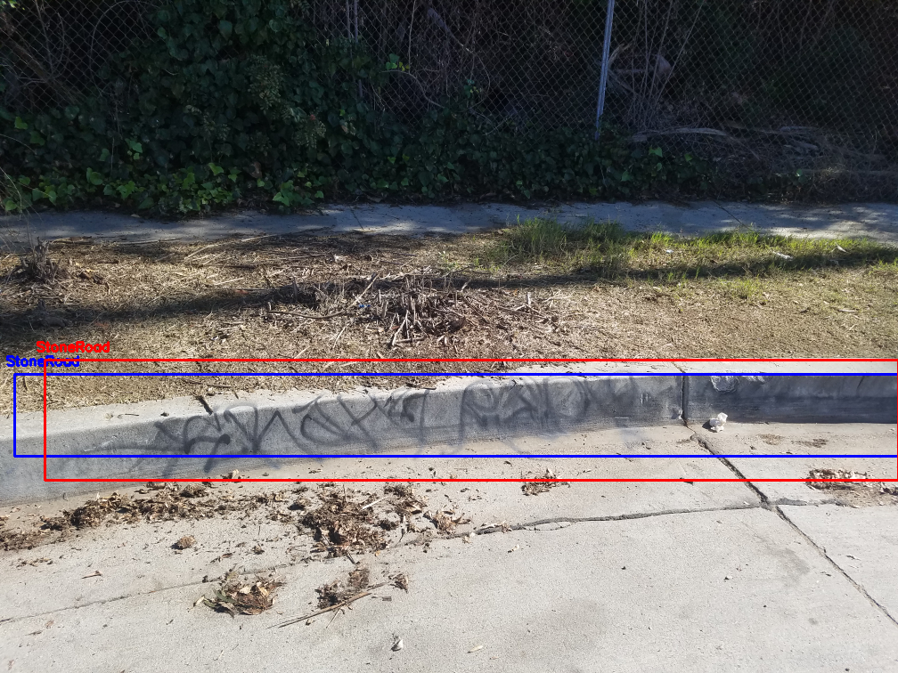
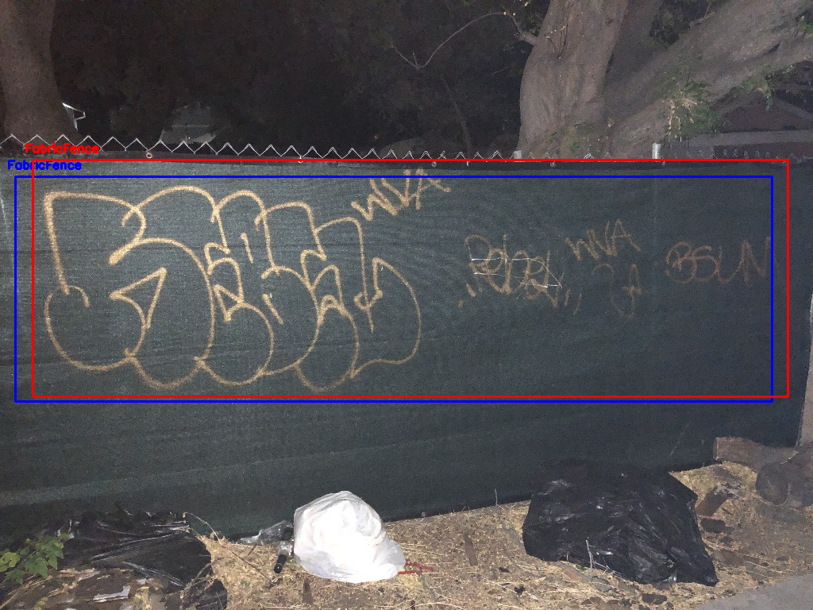

# covered-material-recognition

This repository contains source code and trained models for paper [RECOGNIZING MATERIAL OF A COVERED OBJECT: A CASE STUDY WITH GRAFFITI]()

Sample predictions (ground-truth boxes are blue, predicted boxes are red):

  

## Table of contents

- [Prerequisites](#prerequisites)
- [Quick start](#quick-start)
- [Dataset](#Dataset)
- [Detection](#Detection)
- [Citation](#Citation)

## Prerequisites

You need to install:
- [Python3](https://www.python.org/downloads/)
- [Caffe](http://caffe.berkeleyvision.org/installation.html) (optional)
- Use `requirements.txt` to install required python dependencies

    ```Shell
    # Python 3 is needed
    pip3 install -r requirements.txt
    ```
   

## Quick-start
1. Clone the covered-material-recognition repo: 

    ```Shell
    git clone https://github.com/dweeptrivedi/covered-material-recognition.git
    ```

2. Install python packages:

    ```Shell
    pip3 install -r requirements.txt
    ```

3. Execute `./build_darknet.sh` to download and build Darknet for GPU (will be successful only if GPU support available) and CPU 


## Dataset
1. The authors can provide the dataset when requested. On behalf of the requester, the authors will forward the request to LA City for approval.

    NOTE: The dataset will be structured in PASCAL VOC format (images under JPEGImages, XML files under Annotations directory)

2. To download trained models, execute `./download.sh`


## Detection
- `test.txt` should contain list of image paths that needs detection.

- run `python3 detector.py` for default network.

- output will be stored in following format for each image:
    - `<image name>, class_id1 x1 y1 x2 y2 class_id2 x1 y1 x2 y2`

- Sample combinations:
    - `python3 detector.py --input-file="test.txt" --approach="one-phase" --yolo=50000`
    - `python3 detector.py --input-file="test.txt" --approach="one-phase" --yolo=45000 --heuristic=scale --scaled-dataset`
    - `python3 detector.py --input-file="test.txt" --approach="one-phase" --yolo=45000 --heuristic=segment --segment-dataset`
    - `python3 detector.py --input-file="test.txt" --approach="two-phase" --yolo=100000 --heuristic=base --surface-caffe-weights=45000`
    - `python3 detector.py --input-file="test.txt" --approach="two-phase" --yolo=60000 --heuristic=scale --surface-caffe-weights=80000 --scaled-dataset`
    - `python3 detector.py --input-file="test.txt" --approach="two-phase" --yolo=55000 --heuristic=segment --surface-caffe-weights=90000 --segment-dataset`

- command-line option details:

| option |  possible values | default values | Notes |
| --- | --- | --- | --- |
| --input-file | location of the file | "test.txt" | contains list of image paths that needs detection. |
| --approach | ["one-phase", "two-phase"] | "one-phase" | name of the approach (as described in paper) |
| --heuristic | ["base","scale","segment","baseline"] | "base" | current heuristic("base" for default settings, "scale" for scaled dataset,...) |
| --yolo | int | 45000 | iteration number of Yolo weight file. |
| --surface-caffe-weights | int | 0 | iteration number of Caffe weight file for two-phase approach |
| --nms | float value in [0,1] | 0.45 | nms threshold value for dropping overlapping predictions |
| --thresh | float value in [0,1] | 0.1 | confidence threshold value for predictions |
| --gpu | boolean | False | whether to use GPU or not. Set this option only if `build_darknet.sh` returned successful build for GPU |
| --scaled-dataset | boolean | False | True if using scaled dataset |
| --segment-dataset | boolean | False | True if using segment dataset |
| --scale-val | float | 0.3 | scale factor when using scale heuristic |
| --output-file | path to the output file | "output.csv" | output file path to save predictions . |


## Citation
If you used this code for your experiments or found it helpful, consider citing the following paper:

